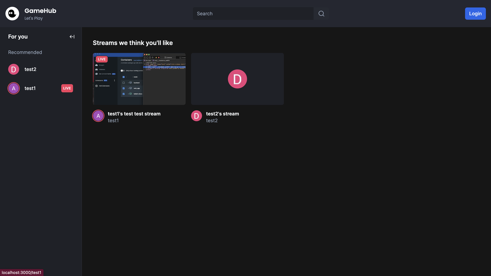

# Fullstack Twitch Clone: Next.js 14, Livestreaming, Online chat, React, Prisma, Tailwind, MySQL




Key Features:

- 📡 Streaming using RTMP / WHIP protocols
- 🌐 Generating ingress
- 🔗 Connecting Next.js app to OBS
- 🔐 Third Party Authentication with Clerk
- 📸 Thumbnail upload with Uploadthing
- 👀 Live viewer count
- 🚦 Live statuses
- 💬 Real-time chat using sockets
- 🎨 Unique color for each viewer in chat
- 👥 Following system
- 🚫 Blocking system
- 👢 Kicking participants from a stream in real-time
- 🔒 Followers only chat mode
- 📴 Enable / Disable chat
- 🔽 Responsive layout (hide sidebars, chat etc, theatre mode etc.)
- 📚 Sidebar following & recommendations tab
- 🏠 Home page recommending streams, sorted by live first
- 🔍 Search results page with a different layout
- 🔄 Syncing user information to our DB using Webhooks
- 📡 Syncing live status information to our DB using Webhooks
- 📄 SSR (Server-Side Rendering)
- 🗃️ MySQL

### Prerequisites

#### Node version 18.17 or later

#### Third platform registion and API key:

Paste required environment variable in to .env ( [Set up .env](###setup-.env-file))

[Livekit](https://livekit.io) is a open source real time streaming service
[Clerk](https://clerk.com) is a third party user management platform
[Uploadthing](https://uploadthing.com) is a third party file storage platform

### Cloning the repository

```shell
git clone https://github.com/80869538/twitch-clone.git
```

### Install packages

```shell
npm i
```

### Setup .env file

```js
NEXT_PUBLIC_CLERK_PUBLISHABLE_KEY=
CLERK_SECRET_KEY=
NEXT_PUBLIC_CLERK_SIGN_IN_URL=/sign-in
NEXT_PUBLIC_CLERK_SIGN_UP_URL=/sign-up
NEXT_PUBLIC_CLERK_AFTER_SIGN_IN_URL=/
NEXT_PUBLIC_CLERK_AFTER_SIGN_UP_URL=/
CLERK_WEBHOOK_SECRET=

DATABASE_URL=

LIVEKIT_API_URL=
LIVEKIT_API_KEY=
LIVEKIT_API_SECRET=
NEXT_PUBLIC_LIVEKIT_WS_URL=

UPLOADTHING_SECRET=
UPLOADTHING_APP_ID=
```

### Setup Prisma

Add MySQL Database (I used PlanetScale)

```shell
npx prisma generate
npx prisma db push

```

### Start the app

```shell
npm run dev
```

### Acknowledgement

Based on project https://github.com/AntonioErdeljac/next14-twitch-clone/tree/master
